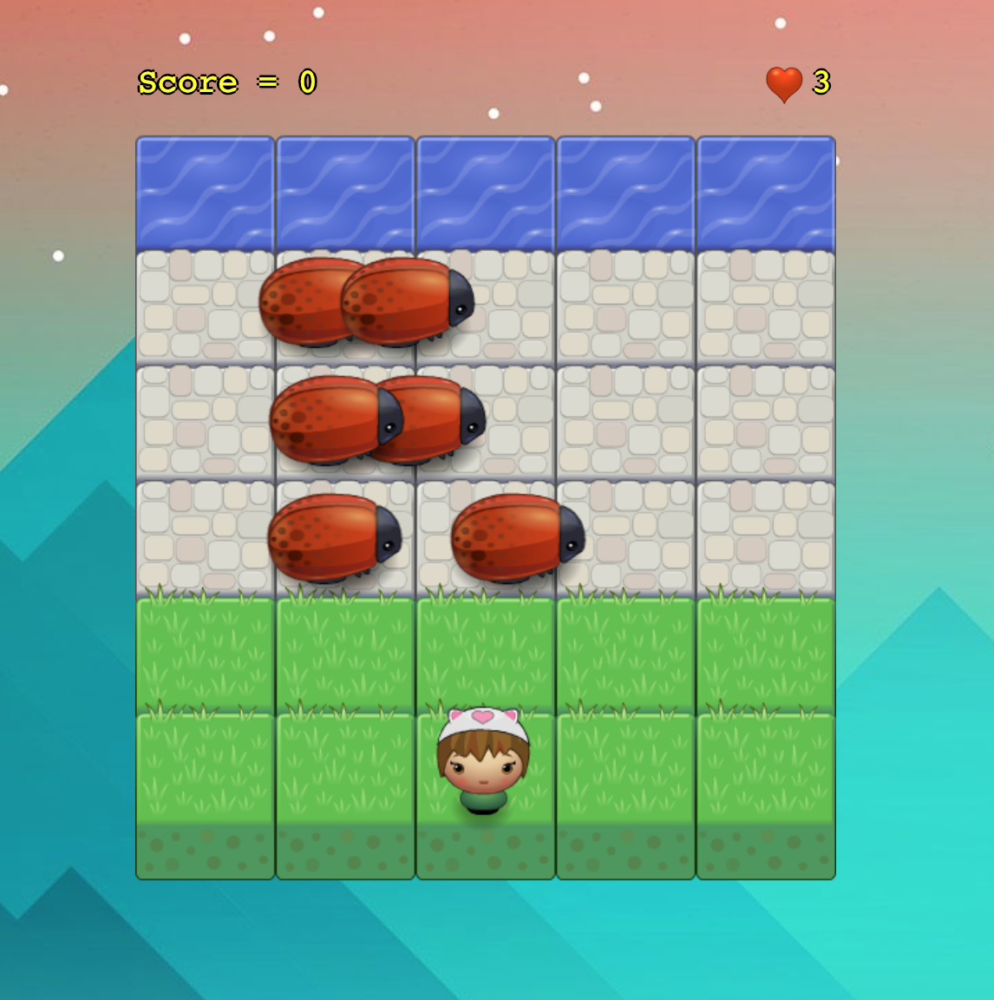

# Classic Arcade Game Clone Challenge

## Context 

This is the classical Arcade Game cloned. 

### How the game works

**In this game you have a Player and Enemies (bugs). The goal of the Player is to reach the water, without colliding into any one of the enemies.**

#### Rules/how to play

- The player can move left, right, up and down with the arrow keys (then, it's only available for laptops/computer keyboards)
- The enemies move at varying speeds on the paved block portion of the game board
- Once a the player collides with an enemy, the score is reset and the player moves back to the starting square (grass) with one life less. The starting number of lives is 3
- Once the player reaches the water (the top of the game board), the score goes up +100 points :)
- If the player reaches zero lives, the game is over...but you can start again! 

### Features
- Object Oriented code
- All the code is documented with Js Docs
- Everything follows the Udacity Js guidelines
- Gitflow has been used
- Semantic version has been used
- No external dependencies

### [Play Demo](https://kooltheba.github.io/arcade-game-clone/)

